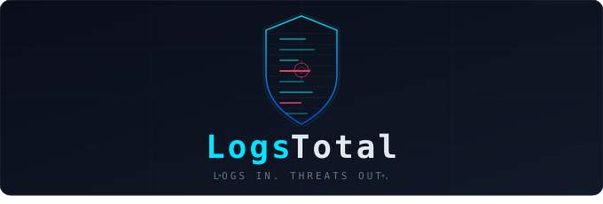
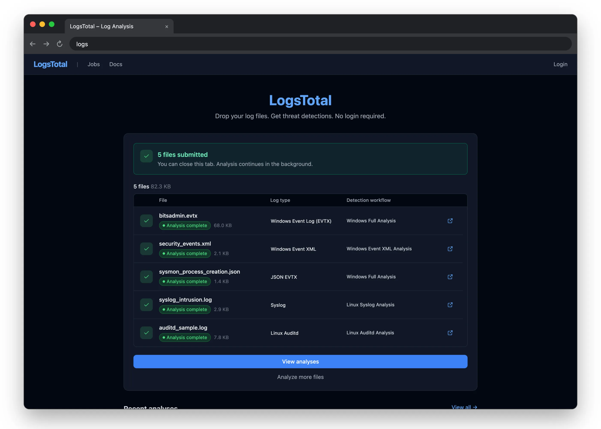
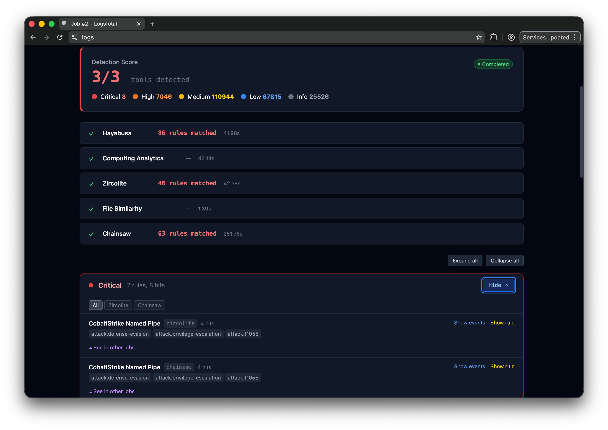
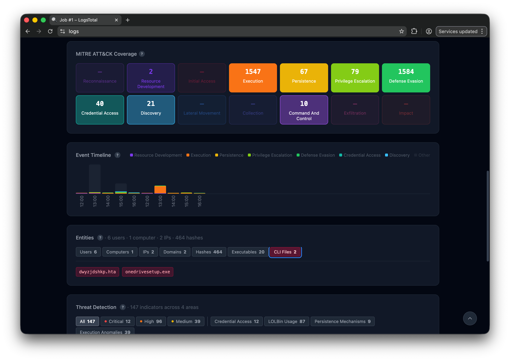

# LogsTotal



**LogsTotal** is a self-hosted log analysis platform. Drop a log file — Windows EVTX or Event
XML, Winlogbeat/EVTX JSON, auditd, syslog, a journald export, Sysmon for Linux — and several
detection engines run Sigma rules over it and report what each one found: findings grouped by
severity, MITRE ATT&CK context, the entities involved, and analyst tooling on top.

No account is needed to submit a file or read public results.

**Detection engines:** [Zircolite](https://github.com/wagga40/Zircolite),
[Chainsaw](https://github.com/WithSecureOpenSource/chainsaw),
[Hayabusa](https://github.com/Yamato-Security/hayabusa) and
[ChopChopGo](https://github.com/M00NLIG7/ChopChopGo). Adding another takes a small adapter,
for a binary or a Docker image — see
[Adding a tool adapter](docs/contribute/development.md#adding-a-tool-adapter).

## Screenshots

| Upload & workflow | Detection | Analytics |
|------------------|---------------------|---------------------|
|  |  |  |

## What you get

- **Drop a log, get a detection report.** Sigma rules run through four engines, and the log
  type is detected on drop.
- **MITRE ATT&CK context** — a tactic heat-map per job.
- **Two timelines** — an hourly activity histogram by tactic, and a zoomable per-alert timeline.
- **Process trees** rebuilt from rule-matched process-creation events.
- **Entity extraction and pivoting**, and **investigation cases**.
- **A relationship graph** with community detection, pathfinding, threat colouring and GraphML export.
- **Rules** — your own detection layer over what an analysis produces, with auto-tagging,
  alerts and signed webhooks.
- **Export to the rest of your stack** — IOC feed (CSV/JSON/STIX/MISP), STIX bundles, MISP
  events, clipboard IOC packs.
- **Fuzzy similarity** — TLSH matching between uploads, plus cross-job rule correlation.

## Access model

| Feature | Admin | Member | User | Anonymous |
|---------|-------|--------|------|-----------|
| Upload and jobs | yes | yes | yes | yes |
| Private submissions | yes | yes | yes | no |
| Intel (entities, cases, rules) | yes | yes | no | no |
| Admin pages and workflows | yes | no | no | no |

Administrators assign roles at `/admin/users`.

## Prerequisites

- Ubuntu or Debian (the tested platforms), with Docker Engine and the Compose plugin.
- `7z` (`p7zip-full`), `rsync` and `curl`.
- Python 3.11 or later on the host, standard library only, for the helper scripts.
- Nothing for the commands themselves: `./logstotal` brings its own pinned Task.
- A desktop browser, 1024px or wider, for the people using it.

The full list, with install commands, is in [Prerequisites](docs/install/prerequisites.md).

## Quick start

Download `logstotal-<version>.7z` from the
[releases page](https://github.com/wagga40/LogsTotal/releases/latest). On the host:

```bash
7z x logstotal-<version>.7z -ologstotal
cd logstotal
./logstotal quickstart
```

`./logstotal quickstart` creates `.env`, generates every secret — including the admin
password, printed once, so save it — builds and checks the stack, starts it, and waits for
it to answer. It is safe to re-run.

Then open `http://<host>:8000` and log in with `ADMIN_EMAIL` from `.env` and the printed
password. The step-by-step version, PostgreSQL, and what to do next are in
[Single-host installation](docs/install/single-host.md).

To upgrade, run `./logstotal upgrade` from the same directory: it downloads the latest
release and applies it. `./logstotal upgrade:rollback` restores the release before it, on
this host or on every host of a fleet. Each rollback consumes its snapshot, so running it
twice goes back two releases. See [Upgrade and rollback](docs/runbooks/upgrading.md).

## Documentation

The administrator documentation is published at **<https://wagga40.github.io/LogsTotal/>**,
and every release ships it in [`docs/`](docs/README.md):

- [Prerequisites](docs/install/prerequisites.md), then
  [single-host installation](docs/install/single-host.md),
  [HTTPS with Caddy](docs/install/https.md),
  [fleet installation](docs/install/fleet.md) or
  [offline installation](docs/install/offline.md)
- [Configuration](docs/configuration.md) — every environment variable
- [Health, logs and first-day checks](docs/runbooks/health-and-logs.md)
- [Upgrade and rollback](docs/runbooks/upgrading.md)
- [Security](docs/security.md) and [Known limitations](docs/limitations.md)
- [Commands](docs/reference/commands.md) — every `./logstotal` command

The guide for analysts (submitting logs, reading results, Intel) is built into the
application, at `/docs`. Contributors start with
[Local development](docs/contribute/local-development.md).

## Project

- [CHANGELOG.md](CHANGELOG.md) — what changed in each release
- [CONTRIBUTING.md](CONTRIBUTING.md) — how to propose a change
- [SECURITY.md](SECURITY.md) — reporting a vulnerability (please don't open a public issue)
- [LICENSE](LICENSE) — MIT
