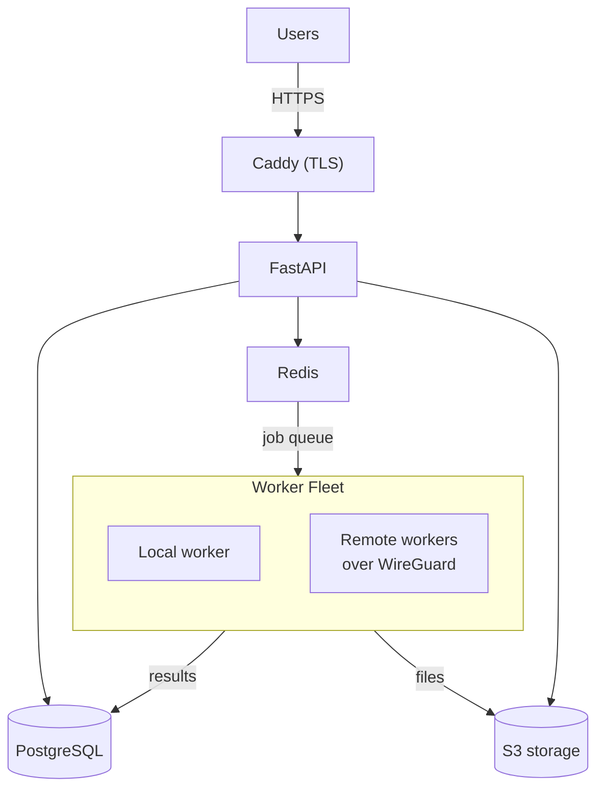

# Fleet installation

How to deploy LogsTotal across several machines: a control plane (web, Redis, PostgreSQL, S3
storage) and dedicated worker machines on a private network.

Take this path when one host can no longer keep up with analysis, or when workers must run
somewhere the web tier does not. Every command on this page runs on your workstation, or on
the control plane itself.

> [!IMPORTANT]
> A fleet **requires PostgreSQL and S3 storage**; the deploy sets both up for you. SQLite and
> local file storage cannot be shared, so remote workers would fail to load uploads or leave
> jobs stuck in `pending`.



Using managed PostgreSQL, Redis or S3 instead of the bundled ones, or a network you build
yourself? Use [Manual fleet installation](fleet-manual.md).

## Prerequisites

- **Hosts:** fresh Ubuntu or Debian machines (see
  [Other operating systems](../reference/fleet.md#other-operating-systems) for anything
  else). The deploy installs Docker, 7z, rsync and curl on them.
- **Access:** SSH key access as `root`, or as a user with passwordless `sudo`. There is no
  password prompt: a key that does not work fails.
- **Workstation:** `ssh` and `scp`, `7z` to build the package, and Python 3.11 or later.
  `./logstotal` brings its own Task. The full table is in
  [Prerequisites](prerequisites.md#what-each-machine-needs).

Secrets, addresses, the database, object storage and the relays between them are all
generated for you.

Every worker mounts its host's Docker socket so it can run Zircolite as a container — read
[Docker socket on workers](../security.md#docker-socket-on-workers) before choosing worker
hosts.

## Before you start: three decisions

Each has a default. Settle them now rather than redeploying later.

**1. A private network — on by default.** A multi-host fleet builds a WireGuard mesh, and
Redis, PostgreSQL and Garage listen only on the tunnel. With `DEPLOY_VPN=none`, those three
listen on a routable interface, protected only by their generated passwords, and you have to
firewall them yourself. The control plane needs inbound **UDP 51820**; the workers need
nothing. Details: [A private network](../reference/fleet.md#a-private-network).

**2. How people reach it.** By default the control plane serves plain HTTP on port
**8000**. Set `DEPLOY_DOMAIN` and Caddy serves it on **80 and 443** instead, with
`DEPLOY_PROXY_TLS` choosing a public certificate (`acme`, the default), Caddy's own
certificate authority for an internal or air-gapped network (`internal`), your own
certificate (`custom`), or plain HTTP behind something else that terminates TLS (`off`).
The modes are compared in [HTTPS with Caddy](https.md#choose-a-tls-mode); the fleet settings
are in [HTTPS and HTTP basic auth](../reference/fleet.md#https-and-http-basic-auth).

**3. Which ports to open.** Ask:

```bash
DEPLOY_HOSTS=cp.example.com,w1.example.com ./logstotal deploy:network
```

It connects to nothing and prints, for the fleet you described, every port, which host
accepts it, from whom, and why. Run it before the first deploy, while opening a firewall
costs nothing.

## Automated setup

Four steps. The middle two give you a file to read and change, and a dry run, before
anything is touched:

```bash
./logstotal deploy:init -- cp.example.com w1.example.com w2.example.com   # 1. name the fleet
$EDITOR deploy.env                                                        # 2. tune it
./logstotal deploy:plan                                                   # 3. see what would happen
./logstotal deploy                                                        # 4. do it
```

**1. `./logstotal deploy:init`** writes `deploy.env` and stops. The **first host is the
control plane**; the others are workers. An entry may be `host` (SSH as root), `user@host`,
or `local` — this machine, without SSH — which lets you run the whole deploy on the control
plane:

```bash
./logstotal deploy:init -- local w1.example.com w2.example.com
```

**2. Edit `deploy.env`.** This is where the fleet is configured: the install directory, the
private network, a domain and TLS, worker counts, the admin address. The annotated template
is [`deploy.env.example`](https://github.com/wagga40/LogsTotal/blob/main/deploy.env.example),
and every setting is described in the [fleet reference](../reference/fleet.md). Nothing has
been contacted yet, so changing your mind costs nothing.

Write one `KEY=value` per line, starting in the first column: no quotes (they become part of
the value), no comments on the same line, no `export`. If a key appears twice, the first one
wins.

**3. `./logstotal deploy:plan`** connects, checks every host, and reports what a deploy
*would* do to each one. It changes nothing — see
[Before you deploy](#before-you-deploy-logstotal-deployplan).

**4. `./logstotal deploy`** does it. It is **idempotent**: running it again converges the
fleet rather than rebuilding it. Secrets are not rotated, keys you added to a host's `.env`
survive, and an existing `.env` on a host is not overwritten.

`./logstotal deploy -- cp.example.com w1.example.com` skips straight to step 4 with the
defaults, writing the same `deploy.env` on the way.

### Where it gets installed

Everything LogsTotal owns on a host lives under one directory, `DEPLOY_REMOTE_DIR`
(`/opt/logstotal` by default):

```
/opt/logstotal/          the install directory
├── (the release)        code, ./logstotal, Taskfile.yml, docker-compose.yml, scripts/
├── .env                 this host's configuration, mode 600
├── data/                the database, when this host has one
├── uploads/             stored log files
├── backups/             database dumps
└── fleet/               the fleet record — control plane only
```

The directory you ran the deploy from is only the toolkit: once the first deploy succeeds
you can delete it. See [Where things live](prerequisites.md#where-things-live).

**Only `./logstotal deploy:remove` deletes the install directory.** An upgrade replaces the
code inside it and leaves `data/`, `uploads/`, `backups/`, `fleet/` and `.env` alone. Do not
point `DEPLOY_REMOTE_DIR` at anything temporary: `/tmp`, or a home directory that something
cleans, is a way to lose a database.

### What it does

| Step | What happens | Its own command |
|------|--------------|-----------------|
| 1 | Checks the local tools (`ssh`, `scp`) | — |
| 2 | Installs Docker with the Compose plugin, 7z, rsync and curl on every host, and creates the install directory. Reports each host's OS and warns if it is outside the tested set, without stopping | `./logstotal deploy:bootstrap` |
| 3 | Builds the WireGuard mesh and records each host's address — on by default for a multi-host fleet | `./logstotal deploy:vpn` |
| 4 | Generates one `.env` per host, with every cross-host URL filled in and each worker named | `./logstotal deploy:env` |
| 5 | Installs each file as that host's `.env`, mode 600 | `./logstotal deploy:env` |
| 6 | Checks SSH, tools, directories and disk on every host | `./logstotal deploy:preflight` |
| 7 | Builds the package and deploys it: stops the workers, then the control plane; stages the release on every host; starts the control plane and waits for it to be healthy; then starts the workers | `./logstotal deploy` |
| 8 | Checks `/health` and the login page | `./logstotal deploy:smoke` |

Each step is a command in its own right, so a fleet that is already running can use them
one at a time — see [Fleet recipes](../reference/fleet.md#fleet-recipes).

### Before you deploy: `./logstotal deploy:plan`

```bash
./logstotal deploy:plan
```

It changes nothing, always exits 0, and is safe to run against a live fleet.

It starts with **what the fleet is configured to be** — domain, TLS mode and the address the
certificate authority will see, basic auth, the private network, the admin account, the
install directory and the worker count — and, beside each value, **where it came from**: your
environment, `deploy.env`, the fleet record, or a built-in default. Read that column when a
value is not the one you edited: it shows whether your `deploy.env` was used at all.

Then it runs the preflight checks and says what a deploy would do to each host:

| Verdict | Meaning |
|---------|---------|
| `FRESH INSTALL` | Nothing installed there yet |
| `UPDATE a → b` | Installed, at a different release from the one you are about to deploy |
| `ALREADY CURRENT` | Same release, containers up |
| `PARTIAL` | Code present but stopped, or directories with no code — what an interrupted deploy leaves behind |
| `BLOCKED — <reason>` | Something that would stop a deploy |

It also checks what a deploy cannot recover from and bootstrap cannot fix: a `RemoteCommand`
for the host in your `~/.ssh/config`, a login shell on the host that rejects ordinary POSIX
syntax, whether you can become root, clock skew, and — with `DEPLOY_VPN=wireconf` — whether
the control plane's firewall lets the WireGuard port through. It reports the firewall rule and
whether anything listens on the port; UDP reachability cannot be proven from outside, so the
VPN step checks for WireGuard handshakes instead.

Finally, it **checks your settings against each other**, because two settings that disagree
cause more failed deploys than broken hosts do:

```
  WARN  DEPLOY_CP_ADDRESS=192.168.1.5 is outside DEPLOY_VPN_NETWORK=10.200.0.0/24, so
        workers will not reach the control plane over the tunnel being built for them.
        Use the hub's mesh address (10.200.0.1), or unset it and let ./logstotal deploy:vpn supply it.
  NOTE  DEPLOY_ADMIN_EMAIL is at other-corp.net, but this fleet serves logs.example.com.
  2 warning(s), 1 note(s) — none of them stops a deploy.
```

`WARN` means "this will not do what you asked"; `NOTE` means "this is unusual, check it was
meant". **Neither stops a deploy.** The same block appears at the start of
`./logstotal deploy`, whether or not you ran the plan first.

Output is coloured on a terminal and plain in a pipe, a file or CI; `NO_COLOR=1` turns colour
off everywhere. For a script, `DEPLOY_PLAN_FORMAT=json` prints one JSON document — settings,
findings, per-host verdicts and counts — on stdout, and the human-readable checks on stderr:

```bash
DEPLOY_PLAN_FORMAT=json ./logstotal deploy:plan 2>/dev/null | jq '.plan.counts'
```

### Starting over: `./logstotal deploy:remove`

```bash
DEPLOY_REMOVE_CONFIRM=yes ./logstotal deploy:remove
```

It stops the stacks (workers first, control plane last), removes their volumes and images,
then deletes `DEPLOY_REMOTE_DIR`. `DEPLOY_REMOVE_KEEP_DATA=yes` keeps `data/`, `uploads/` and
`backups/`; `DEPLOY_REMOVE_VPN=yes` also brings the WireGuard interface down and deletes
`deploy-envs/vpn.json`.

To redeploy from clean without deleting the directory, run `./logstotal deploy` with
`DEPLOY_CLEAN=true DEPLOY_CLEAN_CONFIRM=yes`. Before staging the release, it deletes every
host's containers, volumes — databases included — and images, and leaves
`DEPLOY_REMOTE_DIR` in place.

`deploy:remove` ends by listing **what it did not remove**. On each host: Docker, 7z, rsync
and the other tools `./logstotal deploy:bootstrap` installed, which other software may use;
the firewall rule for the WireGuard port; and, with `DEPLOY_REMOVE_KEEP_DATA=yes`, the data
directories. On the machine you ran it from: `deploy.env` and `deploy-envs/`, which hold **the
only remaining copy of `SECRET_KEY` and the database password** — so nothing deletes them for
you.

Run on a control plane that was deployed *to* rather than *from*, it says so, and tells you
to finish on the machine that holds those files. Run on the control plane, it also warns
that you are standing in the directory it just emptied, and prints the command that finishes
the job.

## After the first deploy

- Upgrade the whole fleet with `./logstotal upgrade`, from the control plane or from the
  machine you deployed from — see [Upgrade and rollback](../runbooks/upgrading.md).
- Day-2 commands (status, logs, stopping and starting hosts, adding a worker) are in the
  [fleet reference](../reference/fleet.md).
- Go through the [first-day checklist](../runbooks/health-and-logs.md#first-day-after-deploy).
