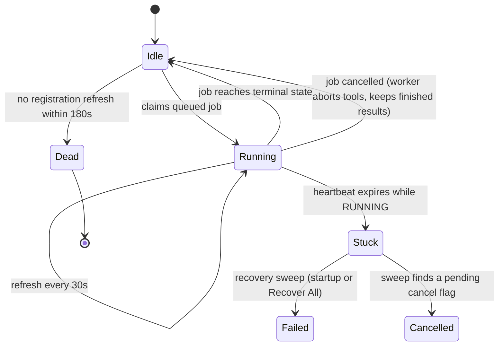

# Worker operations

How to add, drain and limit workers, cancel jobs, and recover jobs whose worker died.

## Worker fleet management

Each worker host has a concurrency limit, set per hostname on `/admin/workers`:

| Value | Meaning |
|-------|---------|
| `0` | Unlimited — the host accepts every job (default). |
| `-1` | Paused — the host takes no jobs, **unless** it is the only live worker. |
| `1` or more | The host runs at most this many jobs at once. |

The limit applies to the whole host, across every worker process on it. When a host is full, the job goes back to the queue after a short random delay instead of waiting on that host.

Three things to know about the limit:

- **A killed worker holds its slot for up to 300 seconds.** A slot is released when the job ends; a `SIGKILL` or an out-of-memory kill skips that, so the host looks busier than it is until the counter expires. To clear it at once, delete the Redis key `logstotal:worker_slots:<hostname>`.
- **A job is accepted anyway after 20 deferrals**, so a host can briefly exceed its limit. Without this, a host that stays full would defer the same job forever.
- **The last live worker ignores a pause.** Pausing every host cannot stop all analysis.

### Drain a worker (rolling restart)

1. On `/admin/workers`, set the host's limit to `-1` (paused).
2. Wait until its current-job column is empty.
3. Stop the worker process or container.
4. Start it again and set the limit back to `0`.

If it is the last live worker, it keeps taking jobs while paused. Treat that as a safety net, not as capacity.

### Add or remove workers

A worker registers itself in Redis when it starts, and refreshes that registration every 30 seconds (every `WORKER_HEARTBEAT_INTERVAL` seconds, capped at a third of `WORKER_ALIVE_TTL`). Adding a worker needs no configuration change: start one, for example with `./logstotal docker:worker-up` on a new worker host. See [Adding a worker later](../reference/fleet.md#adding-a-worker-later) for a fleet.

To remove one, stop it. It disappears from `/admin/workers` when its registration expires (`WORKER_ALIVE_TTL`, 180 seconds by default).

## Cancelling a job

Stop a pending or running job with the **Cancel** button on its job page. Administrators can cancel any job; signed-in users can cancel jobs they submitted; anonymous submissions can be cancelled only by an administrator.

Cancellation keeps partial results:

- **Pending job** — marked `CANCELLED` at once (`error_message="Cancelled by user"`). A worker that later takes it from the queue drops it without running anything.
- **Running job with a live worker** — the worker notices within about 2 seconds, kills the running tool with its whole process tree (or its container), skips the remaining tools, and marks the job `CANCELLED`. **Findings from tools that already finished are kept.**
- **Running job whose worker is gone** — marked `CANCELLED` directly, with `error_message="Cancelled by user (worker lost)"`.

Notes:

- A cancelled job skips the analytics and similarity steps. To compute them for the findings it kept, use **Recalculate** on the job page, or the **Analytics** backfill on `/admin`.
- Cancelling a job that has already finished does nothing.
- A workflow's per-tool `timeout:` kills the tool's whole process group, so a tool that starts child processes cannot outlive it. If a tool still cannot be stopped, the job is finished without it and the stuck thread is cleaned up at the next worker restart.

## Stuck job recovery

A job is stuck when it is `RUNNING` but no worker is working on it — the worker crashed, was killed, or lost its connection to Redis.

### How a stuck job is detected

While it runs a job, a worker refreshes a per-job heartbeat key in Redis. If the worker dies, the key expires and the job can be recognised as stuck. Three settings control this:

| Setting | Default | Meaning |
|---------|---------|---------|
| `WORKER_HEARTBEAT_INTERVAL` | 30 s | How often a worker refreshes its job heartbeat and its fleet registration. |
| `WORKER_HEARTBEAT_TTL` | 60 s | How long a job heartbeat lives. A `RUNNING` job whose heartbeat has expired is stuck. |
| `WORKER_ALIVE_TTL` | 180 s | How long a fleet registration lives. A worker that does not refresh within it drops off `/admin/workers`. |

Keep `WORKER_HEARTBEAT_TTL` at least twice `WORKER_HEARTBEAT_INTERVAL`, so one missed refresh does not make a job look stuck.

Each worker process refreshes its registration from its own thread, whether it is busy or idle. A worker that drops off `/admin/workers` has stopped, or cannot reach Redis.

### Recover stuck jobs

Click **Recover All** on `/admin/workers` (it posts to `/admin/recover-stuck-jobs`). Every `RUNNING` job without a heartbeat is marked `FAILED` with `error_message="Worker lost — recovered by admin"`. A stuck job with a pending cancel request is marked `CANCELLED` with `error_message="Cancelled by user (worker lost)"` instead.

The same sweep fails `PENDING` jobs older than `HUEY_QUEUE_EXPIRY`, with `error_message="Expired in the queue before a worker picked it up"`. The queue discards a job no worker claims within that time, so without the sweep its page would wait forever. Resubmit it once workers have capacity.

The web service runs the same sweep every time it starts, and marks jobs it recovers with `error_message="Worker lost — recovered on startup"`. Restarting the web service after a worker crash therefore clears the jobs that were stuck.

Recovery changes only the job's status. The uploaded file stays in storage, so the job can be **Resubmitted** with the same or another workflow. If recovery runs during a short worker outage, the job is marked failed and the worker discards its result when it comes back.

### When jobs keep getting stuck

1. **Is the worker running?** `docker compose ps worker`, or `/admin/workers`.
2. **Is Redis up?** `docker compose exec redis redis-cli ping` should answer `PONG`. With `REDIS_PASSWORD` set, run `docker compose exec redis sh -c 'redis-cli -a "$REDIS_PASSWORD" --no-auth-warning ping'` instead.
3. **Is the heartbeat key there while a job runs?** Add the same `-a` option as above if Redis has a password: `docker compose exec redis redis-cli --scan --pattern 'logstotal:heartbeat:*'`.
4. **Does the worker log show errors?** `docker compose logs --tail 100 worker` (on a worker host: `docker compose -f docker-compose.worker.yml logs --tail 100 worker`).
5. **Is the worker host overloaded?** A heavily loaded host can miss refreshes for longer than 60 seconds. Raise `WORKER_HEARTBEAT_TTL` to 120.

---

**Related:** [Health, logs and first-day checks](health-and-logs.md) · [Scaling](../scaling.md) · [Troubleshooting](../troubleshooting.md)
